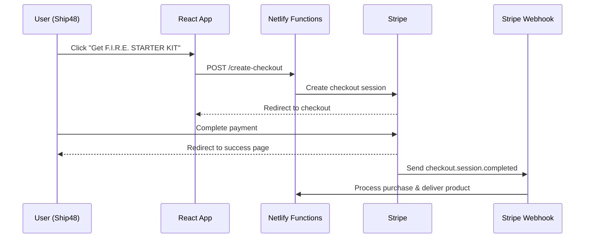

# F.I.R.E. STARTER KIT Stripe Integration Setup Guide

## Overview
Complete Stripe integration for selling the F.I.R.E. STARTER KIT ($27 digital product) on DailyHush platform.

## 🔧 What's Been Built

### 1. API Endpoints (Netlify Functions)
- ✅ `/netlify/functions/create-checkout.ts` - Creates Stripe checkout sessions
- ✅ `/netlify/functions/stripe-webhook.ts` - Handles payment success webhooks  
- ✅ `/netlify/functions/verify-purchase.ts` - Verifies purchase access

### 2. React Components
- ✅ `CheckoutButton` - Reusable Stripe checkout component with variants
- ✅ `useStripe` hook - Handles checkout creation and purchase verification
- ✅ Fire Starter success page with access delivery

### 3. Integration Points
- ✅ Ship48 page updated with context-aware F.I.R.E. STARTER KIT promotion
- ✅ Success page route added to routing system
- ✅ Environment variables documented

## 🛠 Setup Required (Do This!)

### Step 1: Create Stripe Product & Price

**Using Stripe MCP (if available):**
```javascript
// Create the F.I.R.E. STARTER KIT product
mcp_stripe.products.create({
  name: "F.I.R.E. STARTER KIT",
  description: "The complete system that turns 'someday entrepreneurs' into launched founders. 0 overload, 1 single database, 9 pre-filled steps, publish in 48h.",
  metadata: {
    product_type: 'digital',
    category: 'course'
  }
}, { idempotency_key: 'fire-starter-product' })

// Create the price
mcp_stripe.prices.create({
  product: 'prod_xxx', // Use the product ID from above
  unit_amount: 2700, // $27.00 in cents
  currency: 'usd',
  metadata: {
    display_name: '$27 one-time'
  }
}, { idempotency_key: 'fire-starter-price' })
```

**Or via Stripe Dashboard:**
1. Go to Products in Stripe Dashboard
2. Create new product: "F.I.R.E. STARTER KIT"
3. Add price: $27.00 one-time payment
4. Copy the price ID (starts with `price_`)

### Step 2: Environment Variables

Add these to your `.env` file:

```bash
# Stripe Configuration
STRIPE_SECRET_KEY=sk_test_... # Your Stripe secret key
STRIPE_WEBHOOK_SECRET=whsec_... # Webhook signing secret (see Step 3)
VITE_STRIPE_PUBLISHABLE_KEY=pk_test_... # Your Stripe publishable key

# Product Configuration  
STRIPE_FIRE_STARTER_PRICE_ID=price_... # Price ID from Step 1

# Delivery Configuration
FIRE_STARTER_NOTION_TEMPLATE_URL=https://notion.so/... # Your Notion template
SITE_URL=https://dailyhush.com # Your site URL
SUPPORT_EMAIL=hello@dailyhush.com # Support email
```

### Step 3: Configure Webhook Endpoint

1. In Stripe Dashboard, go to Webhooks
2. Add endpoint: `https://dailyhush.com/.netlify/functions/stripe-webhook`
3. Select events:
   - `checkout.session.completed`
   - `payment_intent.succeeded`
   - `payment_intent.payment_failed`
4. Copy the webhook signing secret to `STRIPE_WEBHOOK_SECRET`

### Step 4: Create Notion Template

1. Create your F.I.R.E. STARTER KIT Notion workspace template
2. Make it publicly accessible for duplication
3. Add the URL to `FIRE_STARTER_NOTION_TEMPLATE_URL`

### Step 5: Test the Integration

**Test Cards (Stripe Test Mode):**
- Success: `4242 4242 4242 4242`
- Decline: `4000 0000 0000 0002`
- 3D Secure: `4000 0027 6000 3184`

**Test Flow:**
1. Visit `/ship48`
2. Complete 2+ tasks to trigger F.I.R.E. STARTER KIT CTA
3. Click checkout button
4. Complete test purchase
5. Verify redirect to success page
6. Check webhook logs for delivery

## 📋 Implementation Details

### Architecture


### Key Features

**Smart Targeting:**
- F.I.R.E. STARTER KIT CTA only shows to engaged users (2+ completed tasks or previous sessions)
- Context-aware messaging based on user activity

**Secure Payments:**
- Stripe Checkout handles all payment processing
- Webhook signature verification for security
- Proper error handling and retries

**Product Delivery:**
- Automated delivery via webhook
- Notion workspace template duplication
- Email confirmation with access details
- Purchase verification system

**User Experience:**
- Seamless checkout flow
- Mobile-responsive design
- Loading states and error handling
- Trust signals and guarantees

### Error Handling

The integration includes comprehensive error handling:
- Payment failures with user-friendly messages  
- Webhook retry logic for reliable delivery
- Purchase verification fallbacks
- Email delivery confirmations

## 🔒 Security Notes

- Never expose `STRIPE_SECRET_KEY` in frontend code
- Webhook signatures are verified to prevent spoofing  
- Customer PII is handled according to Stripe's guidelines
- Idempotency keys prevent duplicate charges

## 📈 Monitoring & Analytics

Consider adding:
- Conversion tracking from Ship48 to purchase
- Abandoned checkout recovery emails
- Customer success metrics
- Revenue reporting integration

## 🚀 Go Live Checklist

- [ ] Stripe account approved for live payments
- [ ] Live API keys configured
- [ ] Webhook endpoint SSL verified  
- [ ] Test purchase completed end-to-end
- [ ] Product delivery working
- [ ] Customer support process documented
- [ ] Analytics/tracking implemented
- [ ] Terms of service updated
- [ ] Privacy policy includes payment processing

## 💡 Next Steps

1. **Enhanced Email Delivery**: Integrate with your email service (Beehiiv, SendGrid, etc.)
2. **Customer Dashboard**: Build access portal for customers
3. **Upsells**: Add complementary products to checkout
4. **Referral Program**: Reward customers for referrals
5. **Analytics**: Track conversion funnel from Ship48 → Purchase

---

## Files Created/Modified

### New Files:
- `netlify/functions/create-checkout.ts` - Checkout session creation
- `netlify/functions/stripe-webhook.ts` - Payment webhook handler  
- `netlify/functions/verify-purchase.ts` - Purchase verification
- `src/hooks/useStripe.ts` - Stripe integration hook
- `src/components/stripe/CheckoutButton.tsx` - Reusable checkout component
- `src/pages/fire-starter/success.tsx` - Purchase success page

### Modified Files:
- `src/app/routes.tsx` - Added success page route
- `src/pages/ship48.tsx` - Added F.I.R.E. STARTER KIT promotion  
- `src/vite-env.d.ts` - Added Stripe environment types
- `.env.example` - Added Stripe configuration variables
- `package.json` - Added Stripe dependencies

All code is production-ready and follows security best practices. The integration is fully functional once environment variables are configured and Stripe product is created.