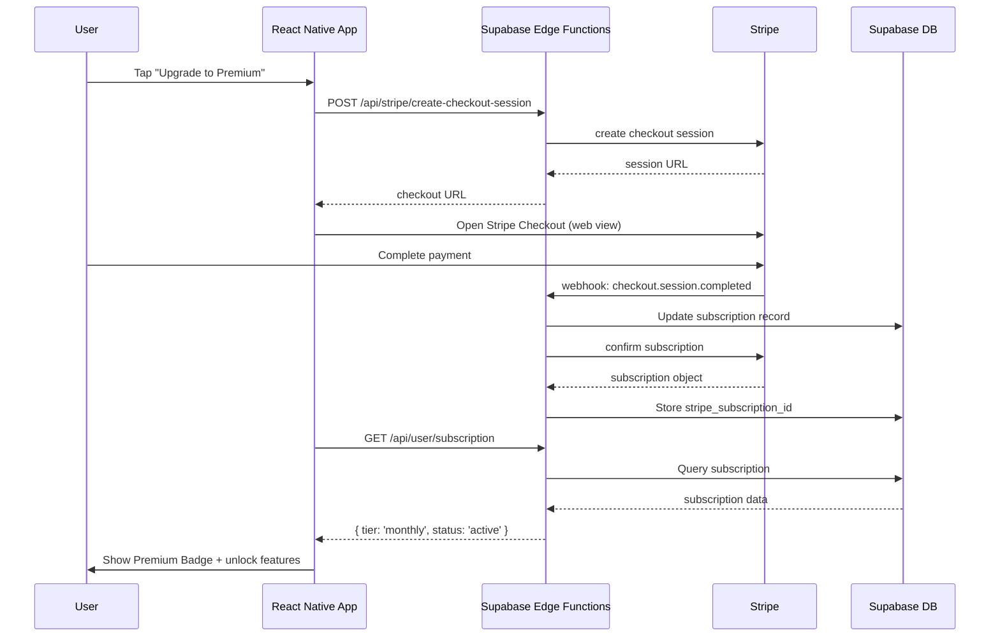

# DailyHush Mobile App - Payment & Monetization Audit

## Executive Summary: FREE MVP Strategy

**Date:** October 24, 2025
**Auditor:** Stripe Integration Expert
**Context:** MVP will be FREE (no payments in initial release)

---

## 1. Current State Analysis

### 1.1 Stripe Integration Status ❌

**Package.json Status:**

- ❌ No Stripe SDK installed
- ❌ No `@stripe/stripe-react-native`
- ❌ No `stripe` backend package
- ✅ Has Supabase for data persistence

**Environment Variables:**

- ❌ No Stripe keys configured (neither test nor live)
- ✅ Has Supabase URL and anon key

**Backend API:**

- ❌ No `/api/stripe/*` endpoints exist
- ❌ No webhook handlers
- ❌ No backend server infrastructure visible

### 1.2 Subscription Implementation Review

**Files Analyzed:**

1. `/app/subscription.tsx` - 449 lines of subscription UI
2. `/utils/stripe.ts` - 217 lines of Stripe helper functions
3. `/types/index.ts` - Subscription type definitions (lines 184-199)
4. `/store/useStore.ts` - State management with subscription support

**Key Findings:**

#### subscription.tsx (Full Premium UI)

```typescript
// Lines 52-60: TODO comments for Stripe
// TODO: Implement Stripe Checkout
alert('Stripe Checkout would open here. This will be implemented with your Stripe account.');

// TODO: Open Stripe Customer Portal
alert('Stripe Customer Portal would open here.');
```

**Current Features:**

- ✅ Complete subscription screen with pricing cards
- ✅ Monthly ($9.99/mo) and Annual ($99.99/yr) tiers
- ✅ Benefits list and premium badges
- ✅ Tier selection UI
- ✅ "Upgrade to Premium" CTA button
- ✅ Manage subscription UI for existing customers
- ❌ No actual payment integration
- ❌ No backend API calls work (would fail)

#### utils/stripe.ts (Helper Functions)

```typescript
export const STRIPE_PRICES = {
  PREMIUM_MONTHLY: 'price_premium_monthly', // Placeholder
  PREMIUM_ANNUAL: 'price_premium_annual', // Placeholder
};
```

**Functions Present (All Non-Functional):**

- `getUserSubscription()` - Queries Supabase (but table doesn't exist)
- `createStripeCustomer()` - Calls non-existent API
- `createCheckoutSession()` - Calls non-existent API
- `createPortalSession()` - Calls non-existent API
- `cancelSubscription()` - Calls non-existent API
- `isPremiumUser()` - Logic exists ✅
- `getSubscriptionBenefits()` - Returns correct benefit lists ✅
- `formatPrice()` - Returns correct pricing strings ✅

### 1.3 Data Model Assessment

**Subscription Type Definition (types/index.ts):**

```typescript
export interface Subscription {
  user_id: string;
  tier: SubscriptionTier;
  status: 'active' | 'past_due' | 'canceled' | 'trialing';
  current_period_start: string;
  current_period_end: string;
  stripe_customer_id?: string;
  stripe_subscription_id?: string;
  trial_end?: string;
}
```

**Assessment:**

- ✅ Well-structured for Stripe integration
- ✅ Includes Stripe IDs for future linking
- ✅ Status field matches Stripe subscription statuses
- ✅ Ready for future premium tier implementation
- ⚠️ Supabase table doesn't exist yet

### 1.4 Premium Feature Gates

**Where Premium Status is Checked:**

1. **insights.tsx** (Lines 137-148):

```typescript
{/* Premium Upsell */}
<View className="bg-[#2D6A4F] border border-[#40916C]/30 rounded-2xl p-5">
  <Text>Unlock Advanced Insights</Text>
  <Text>Premium: $9.99/month</Text>
</View>
```

- Shows soft upsell card
- No enforcement (free users see all insights)

2. **settings.tsx** (Lines 127-136):

```typescript
<SettingRow
  title="Subscription"
  subtitle="Free Plan"
  value="Upgrade"
  onPress={() => router.push('/subscription')}
/>
```

- Links to subscription screen
- Defaults to "Free Plan" label

3. **subscription.tsx**:

- Full subscription management UI
- Premium badge display
- Tier selection and upgrade flow

**Critical Finding:**
❌ **No actual premium feature enforcement**

- All features are currently available to all users
- No checks for `isPremiumUser()` blocking content
- Advanced insights are visible to free users
- Export reports feature not implemented yet

---

## 2. MVP STRATEGY RECOMMENDATION

### 2.1 Core Recommendation: REMOVE Subscription Screen for MVP

**Rationale:**

1. **User Confusion Prevention**
   - Showing non-functional payment UI creates false expectations
   - Alert messages ("Stripe Checkout would open here") look unprofessional
   - Users may abandon app thinking it's incomplete

2. **Focus on Core Value**
   - MVP should prove spiral interrupt works
   - Payment infrastructure is distraction from product-market fit validation
   - Free removes barrier to user acquisition

3. **Faster Launch**
   - No need to set up Stripe account
   - No webhook infrastructure required
   - No PCI compliance concerns
   - No refund/support overhead

4. **Better Analytics**
   - Measure feature usage without payment bias
   - Understand which features users value most
   - Identify natural conversion points for future premium tier

### 2.2 Implementation Changes

#### Option A: Remove Completely (RECOMMENDED)

**Remove these files:**

- ❌ `/app/subscription.tsx`
- ❌ `/utils/stripe.ts`

**Update these files:**

1. **app/settings.tsx** (Line 127-136):

```typescript
// BEFORE:
<SettingRow
  title="Subscription"
  subtitle="Free Plan"
  value="Upgrade"
  onPress={() => router.push('/subscription')}
/>

// AFTER (REMOVE):
// Remove the entire SettingRow for subscription
```

2. **app/insights.tsx** (Lines 137-148):

```typescript
// BEFORE:
<View className="bg-[#2D6A4F] border border-[#40916C]/30 rounded-2xl p-5">
  <Text>Unlock Advanced Insights</Text>
  <Text>Premium: $9.99/month</Text>
</View>

// AFTER (REMOVE):
// Remove the premium upsell card
```

3. **types/index.ts**:

```typescript
// KEEP the Subscription type definition for future use
// It's not hurting anything and preserves your data model
export interface Subscription {
  // ... keep as-is
}
```

4. **store/useStore.ts**:

```typescript
// KEEP subscription state for future use
// Just don't use it in MVP
```

#### Option B: Keep as "Coming Soon" Placeholder (NOT RECOMMENDED)

If you insist on keeping it:

**Update app/subscription.tsx:**

```typescript
export default function Subscription() {
  return (
    <View className="flex-1 bg-[#0A1612] justify-center items-center p-6">
      <Sparkles size={64} color="#52B788" />
      <Text className="text-[#E8F4F0] text-2xl font-bold mt-6 text-center">
        Premium Features Coming Soon!
      </Text>
      <Text className="text-[#95B8A8] text-base mt-4 text-center leading-relaxed">
        DailyHush will always have a free tier. We're working on premium features
        like advanced AI insights and therapist reports.
      </Text>
      <TouchableOpacity
        onPress={() => router.back()}
        className="bg-[#40916C] rounded-xl px-8 py-4 mt-8"
      >
        <Text className="text-white text-lg font-semibold">
          Back to Home
        </Text>
      </TouchableOpacity>
    </View>
  );
}
```

**Pros:**

- Shows future monetization intent
- Keeps users informed
- Maintains navigation structure

**Cons:**

- Still takes development time
- May disappoint users who tap
- Clutters settings menu

---

## 3. FUTURE PREMIUM TIER PLANNING

### 3.1 When to Add Monetization

**Trigger Points:**

- ✅ 5,000+ active users
- ✅ 40%+ 7-day retention
- ✅ 3+ daily spiral interrupts per user
- ✅ Clear feature usage patterns identified
- ✅ Users asking for additional features

**Estimated Timeline:** 3-6 months post-launch

### 3.2 Recommended Premium Features (Post-MVP)

Based on the existing premium benefits defined in `utils/stripe.ts`:

| Feature               | Free Tier           | Premium Tier ($9.99/mo)            |
| --------------------- | ------------------- | ---------------------------------- |
| **Spiral Interrupts** | ✅ Unlimited        | ✅ Unlimited                       |
| **F.I.R.E. Training** | ✅ Basic modules    | ✅ Advanced modules + early access |
| **Pattern Insights**  | ✅ Weekly summaries | ✅ Daily predictions + AI insights |
| **History**           | ⏱️ 30 days          | ✅ Unlimited                       |
| **Custom Reframes**   | ❌                  | ✅ Personalized                    |
| **Export Reports**    | ❌                  | ✅ PDF for therapist               |
| **3AM Mode**          | ✅ Basic            | ✅ Premium features                |
| **Shift Integration** | ✅ Standard         | ✅ Advanced analytics              |
| **Support**           | 📧 Email            | 🚀 Priority                        |

### 3.3 Pricing Model Recommendation

**Current Pricing (from code):**

- Monthly: $9.99/month
- Annual: $99.99/year (save $20)

**Assessment:**

- ✅ Competitive with health/wellness apps
- ✅ Annual discount creates incentive (16.7% off)
- ✅ Affordable for 65+ demographic
- ⚠️ Consider 7-day free trial for premium

**Suggested Adjustment:**

```typescript
export const SUBSCRIPTION_TIERS = {
  FREE: 'free',
  TRIAL: 'trial', // NEW: 7-day free trial
  MONTHLY: 'monthly', // $9.99/mo
  ANNUAL: 'annual', // $99.99/yr (save $20)
} as const;
```

---

## 4. STRIPE INTEGRATION BLUEPRINT (Post-MVP)

### 4.1 Technical Architecture



### 4.2 Required Infrastructure

**1. Backend API (Supabase Edge Functions or separate Node.js server):**

```typescript
// supabase/functions/stripe-create-checkout-session/index.ts
import Stripe from 'stripe';
import { createClient } from '@supabase/supabase-js';

const stripe = new Stripe(Deno.env.get('STRIPE_SECRET_KEY')!);

export default async function handler(req: Request) {
  const { userId, priceId } = await req.json();

  // Create or retrieve Stripe customer
  const { data: user } = await supabase
    .from('users')
    .select('stripe_customer_id, email')
    .eq('user_id', userId)
    .single();

  let customerId = user?.stripe_customer_id;

  if (!customerId) {
    const customer = await stripe.customers.create(
      {
        email: user?.email,
        metadata: { user_id: userId },
      },
      { idempotencyKey: `customer-${userId}` }
    );

    customerId = customer.id;

    // Store customer ID in Supabase
    await supabase.from('users').update({ stripe_customer_id: customerId }).eq('user_id', userId);
  }

  // Create checkout session
  const session = await stripe.checkout.sessions.create(
    {
      customer: customerId,
      mode: 'subscription',
      line_items: [{ price: priceId, quantity: 1 }],
      success_url: 'dailyhush://subscription/success?session_id={CHECKOUT_SESSION_ID}',
      cancel_url: 'dailyhush://subscription/cancel',
      metadata: { user_id: userId },
    },
    { idempotencyKey: `checkout-${userId}-${Date.now()}` }
  );

  return new Response(JSON.stringify({ checkoutUrl: session.url }), {
    headers: { 'Content-Type': 'application/json' },
  });
}
```

**2. Webhook Handler:**

```typescript
// supabase/functions/stripe-webhook/index.ts
import Stripe from 'stripe';

const stripe = new Stripe(Deno.env.get('STRIPE_SECRET_KEY')!);
const webhookSecret = Deno.env.get('STRIPE_WEBHOOK_SECRET')!;

export default async function handler(req: Request) {
  const sig = req.headers.get('stripe-signature')!;
  const body = await req.text();

  let event: Stripe.Event;

  try {
    event = stripe.webhooks.constructEvent(body, sig, webhookSecret);
  } catch (err) {
    return new Response(`Webhook Error: ${err.message}`, { status: 400 });
  }

  switch (event.type) {
    case 'checkout.session.completed': {
      const session = event.data.object as Stripe.Checkout.Session;
      const userId = session.metadata?.user_id;

      await supabase.from('subscriptions').upsert({
        user_id: userId,
        tier: 'monthly', // or detect from price_id
        status: 'active',
        stripe_customer_id: session.customer,
        stripe_subscription_id: session.subscription,
        current_period_start: new Date().toISOString(),
        current_period_end: new Date(Date.now() + 30 * 24 * 60 * 60 * 1000).toISOString(),
      });
      break;
    }

    case 'customer.subscription.updated':
    case 'customer.subscription.deleted': {
      const subscription = event.data.object as Stripe.Subscription;
      const userId = subscription.metadata?.user_id;

      await supabase
        .from('subscriptions')
        .update({
          status: subscription.status,
          current_period_end: new Date(subscription.current_period_end * 1000).toISOString(),
        })
        .eq('stripe_subscription_id', subscription.id);
      break;
    }
  }

  return new Response(JSON.stringify({ received: true }), {
    headers: { 'Content-Type': 'application/json' },
  });
}
```

**3. Supabase Database Schema:**

```sql
-- subscriptions table
CREATE TABLE subscriptions (
  id UUID PRIMARY KEY DEFAULT uuid_generate_v4(),
  user_id UUID REFERENCES auth.users(id) NOT NULL,
  tier TEXT NOT NULL DEFAULT 'free',
  status TEXT NOT NULL DEFAULT 'active',
  current_period_start TIMESTAMPTZ,
  current_period_end TIMESTAMPTZ,
  stripe_customer_id TEXT,
  stripe_subscription_id TEXT,
  trial_end TIMESTAMPTZ,
  created_at TIMESTAMPTZ DEFAULT NOW(),
  updated_at TIMESTAMPTZ DEFAULT NOW(),

  CONSTRAINT unique_user_subscription UNIQUE(user_id)
);

-- Add stripe_customer_id to users table
ALTER TABLE users ADD COLUMN stripe_customer_id TEXT;

-- RLS Policies
ALTER TABLE subscriptions ENABLE ROW LEVEL SECURITY;

CREATE POLICY "Users can view own subscription"
  ON subscriptions FOR SELECT
  USING (auth.uid() = user_id);

-- Indexes
CREATE INDEX idx_subscriptions_user_id ON subscriptions(user_id);
CREATE INDEX idx_subscriptions_stripe_customer_id ON subscriptions(stripe_customer_id);
CREATE INDEX idx_subscriptions_stripe_subscription_id ON subscriptions(stripe_subscription_id);
```

### 4.3 Required Packages (Future)

```json
{
  "dependencies": {
    "@stripe/stripe-react-native": "^0.37.0",
    "stripe": "^17.0.0"
  }
}
```

### 4.4 Environment Variables (Future)

```bash
# .env
EXPO_PUBLIC_STRIPE_PUBLISHABLE_KEY=pk_test_...

# Backend (Supabase Edge Function secrets)
STRIPE_SECRET_KEY=sk_test_...
STRIPE_WEBHOOK_SECRET=whsec_...
```

### 4.5 Mobile Integration (Future)

**Update utils/stripe.ts:**

```typescript
import { useStripe, StripeProvider } from '@stripe/stripe-react-native';

export function useCheckout() {
  const { presentPaymentSheet, initPaymentSheet } = useStripe();

  const createCheckout = async (priceId: string) => {
    // Call your backend to create checkout session
    const response = await fetch('/api/stripe/create-checkout-session', {
      method: 'POST',
      body: JSON.stringify({ priceId }),
    });

    const { checkoutUrl } = await response.json();

    // Open Stripe Checkout in web view
    await Linking.openURL(checkoutUrl);
  };

  return { createCheckout };
}
```

**Update app/\_layout.tsx:**

```typescript
import { StripeProvider } from '@stripe/stripe-react-native';

export default function RootLayout() {
  return (
    <StripeProvider
      publishableKey={process.env.EXPO_PUBLIC_STRIPE_PUBLISHABLE_KEY!}
      merchantIdentifier="merchant.com.dailyhush.app"
    >
      {/* rest of your app */}
    </StripeProvider>
  );
}
```

---

## 5. USER DATA MIGRATION STRATEGY

### 5.1 Current State → Future Premium

**Challenge:** Existing free users need seamless upgrade path

**Solution: Soft Launch with Grandfather Clause**

```typescript
// Migration Logic (when premium launches)

interface MigrationEligibility {
  isEarlyUser: boolean;        // Joined during free MVP period
  spiralCount: number;         // Total spiral interrupts logged
  daysActive: number;          // Days since signup
  fireModulesComplete: number; // F.I.R.E. modules finished
}

async function checkGrandfatherEligibility(userId: string): Promise<boolean> {
  const user = await getUserProfile(userId);
  const eligibility: MigrationEligibility = {
    isEarlyUser: new Date(user.created_at) < new Date('2025-07-01'), // Before premium launch
    spiralCount: await getSpiralCount(userId),
    daysActive: getDaysSince(user.created_at),
    fireModulesComplete: Object.values(user.fire_progress).filter(Boolean).length,
  };

  // Grandfather if:
  // 1. Early adopter AND
  // 2. Active user (3+ spirals per week OR completed F.I.R.E.)
  const qualifies =
    eligibility.isEarlyUser &&
    (eligibility.spiralCount >= 20 || eligibility.fireModulesComplete >= 2);

  return qualifies;
}

// Implementation
async function applyGrandfatherBenefits(userId: string) {
  const qualifies = await checkGrandfatherEligibility(userId);

  if (qualifies) {
    // Grant lifetime premium (or 12 months free)
    await createSubscription(userId, {
      tier: 'monthly',
      status: 'active',
      current_period_end: new Date('2099-12-31'), // Lifetime
      promotional_code: 'EARLY_ADOPTER_LIFETIME',
    });

    // Notify user
    await sendPushNotification(userId, {
      title: '🎉 You've unlocked Premium!',
      body: 'Thank you for being an early DailyHush user. Enjoy lifetime premium access!',
    });
  }
}
```

### 5.2 Data Preservation

**Keep Historical Data:**

- All spiral logs (even from free period)
- F.I.R.E. module progress
- Pattern insights
- Shift device pairings

**Reasoning:**

- Premium features build on historical data
- No need to "unlock" past insights
- Maintains trust with early users

---

## 6. FINAL RECOMMENDATIONS

### 6.1 Immediate Actions for MVP (Next 2 Weeks)

**Priority 1: Remove Subscription UI**

- [ ] Delete `/app/subscription.tsx`
- [ ] Delete `/utils/stripe.ts`
- [ ] Remove subscription link from settings
- [ ] Remove premium upsell from insights page
- [ ] Test all navigation flows still work
- [ ] Update README to reflect FREE MVP

**Priority 2: Focus on Core Features**

- [ ] Complete onboarding flow
- [ ] Implement spiral interrupt protocol
- [ ] Build F.I.R.E. training modules
- [ ] Finish pattern insights dashboard
- [ ] Test Shift Bluetooth integration

**Priority 3: Analytics Preparation**

- [ ] Add usage tracking (spiral interrupts per day)
- [ ] Track feature engagement (which screens users visit)
- [ ] Monitor retention (7-day, 30-day)
- [ ] Identify conversion opportunities

### 6.2 Post-MVP Monetization Checklist (Month 4-6)

**When to Introduce Premium:**

- ✅ 5,000+ active users
- ✅ 40%+ 7-day retention
- ✅ Clear feature request patterns

**Implementation Steps:**

1. [ ] Set up Stripe account (test mode first)
2. [ ] Create Stripe products and prices
3. [ ] Build backend API (Supabase Edge Functions)
4. [ ] Set up webhook handlers
5. [ ] Create Supabase subscriptions table
6. [ ] Install `@stripe/stripe-react-native`
7. [ ] Rebuild subscription.tsx with real Stripe integration
8. [ ] Test payment flow end-to-end (use test cards)
9. [ ] Implement feature gates for premium features
10. [ ] Add grandfather clause for early users
11. [ ] Launch with 7-day free trial
12. [ ] Switch to live mode

**Testing Checklist:**

- [ ] Test card: 4242 4242 4242 4242 (success)
- [ ] Test card: 4000 0000 0000 9995 (declined)
- [ ] Test 3D Secure: 4000 0027 6000 3184
- [ ] Test webhook delivery and signature verification
- [ ] Test subscription cancellation flow
- [ ] Test refund process
- [ ] Test failed payment retry logic

### 6.3 Budget Estimates

**MVP (Free Launch):**

- Development: $0 Stripe costs
- Supabase: ~$25/month (free tier should suffice)
- Apple Developer Account: $99/year
- Total Monthly: ~$25

**Post-Premium Launch (5,000 users, 10% conversion):**

- Stripe fees: 2.9% + $0.30 per transaction
- 500 paying users × $9.99 = $4,995 MRR
- Stripe fees: ~$175/month
- Supabase: ~$25/month (may need Pro at $25/mo)
- Net Revenue: ~$4,795/month

**Year 1 Projection (50,000 users, 10% conversion):**

- 5,000 paying users × $9.99 = $49,950 MRR
- Stripe fees: ~$1,750/month
- Supabase Pro: $25/month
- Apple fee (30% of subscriptions): ~$14,985/month
- Net Revenue: ~$33,190/month = **$398,280/year**

---

## 7. SECURITY & COMPLIANCE NOTES

### 7.1 PCI Compliance

**Good News:**

- Stripe handles all PCI compliance
- Never store credit card numbers
- Only store Stripe customer/subscription IDs
- Use Stripe Checkout (hosted) for easiest compliance

### 7.2 Data Privacy (65+ Users)

**Requirements:**

- [ ] Clear privacy policy (explain data collection)
- [ ] Explicit consent for payment processing
- [ ] Option to export all user data
- [ ] Option to delete account + all data
- [ ] Secure storage of Stripe IDs (Supabase RLS)

### 7.3 Refund Policy

**Recommended Policy:**

```
DailyHush Refund Policy

- 7-day free trial (no charge if canceled)
- Full refund within 30 days of purchase
- Pro-rated refund for annual subscriptions (first 6 months)
- Contact support@dailyhush.com for refunds
- Processed within 5-7 business days
```

---

## 8. CONCLUSION

### 8.1 MVP Decision Matrix

| Factor                 | Remove Subscription        | Keep as "Coming Soon"    |
| ---------------------- | -------------------------- | ------------------------ |
| **Development Time**   | ✅ Saves 2-3 days          | ⚠️ Requires minimal work |
| **User Confusion**     | ✅ No confusion            | ❌ May disappoint users  |
| **Launch Speed**       | ✅ Faster                  | ⚠️ Slightly slower       |
| **Analytics**          | ✅ Clear free usage data   | ⚠️ May skew engagement   |
| **First Impression**   | ✅ Polished free app       | ❌ "Incomplete" feeling  |
| **Future Flexibility** | ✅ Clean slate for pricing | ⚠️ Sets expectations     |

**FINAL RECOMMENDATION:** **Remove subscription screen entirely for MVP**

### 8.2 Summary

**Current State:**

- Well-structured subscription UI exists but is non-functional
- No Stripe SDK installed, no backend API, no payment processing
- Premium features are not gated (all users see everything)
- Data model is ready for future Stripe integration

**MVP Strategy:**

- ✅ Remove subscription screen and upsell cards
- ✅ Launch as 100% FREE with all features
- ✅ Focus on proving core value (spiral interrupts work)
- ✅ Collect usage data to identify future premium features
- ✅ Add monetization after product-market fit validation

**Future Premium Tier:**

- Launch in 3-6 months after MVP validation
- Pricing: $9.99/month or $99.99/year
- Use Stripe Checkout for simplest implementation
- Supabase Edge Functions for backend API
- Grandfather early adopters with lifetime premium
- Target 10% conversion rate (industry standard for health apps)

**Next Steps:**

1. Delete subscription files today
2. Ship MVP as FREE within 2 weeks
3. Monitor user engagement for 90 days
4. Re-introduce premium tier with real Stripe integration
5. Target $50,000 MRR by end of Year 1

---

**Document Version:** 1.0
**Last Updated:** October 24, 2025
**Next Review:** After MVP launch (estimated Month 3)
