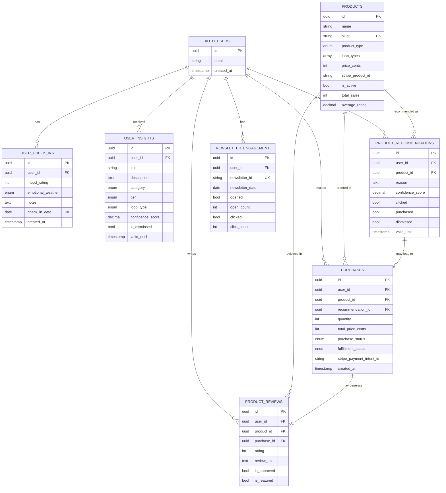

# DailyHush Profile Page - Database Schema Documentation

## Overview

This document provides comprehensive documentation for the DailyHush profile page database schema, including table relationships, RLS policies, indexes, and common query patterns.

## Table of Contents

1. [Schema Architecture](#schema-architecture)
2. [Table Relationships](#table-relationships)
3. [Tables Reference](#tables-reference)
4. [RLS Policies](#rls-policies)
5. [Indexes & Performance](#indexes--performance)
6. [Common Queries](#common-queries)
7. [Best Practices](#best-practices)

---

## Schema Architecture

### Design Principles

- **Privacy First**: Every table has Row Level Security (RLS) enabled
- **Read-Heavy Optimization**: Indexes optimized for common read patterns
- **Denormalization**: Strategic denormalization for performance (product stats)
- **Soft Deletes**: Foreign key constraints preserve data integrity
- **Time-Series Ready**: Optimized for temporal queries and trend analysis

### Core Entities

```
┌─────────────────────────────────────────────────────────────┐
│                     DailyHush Profile Schema                │
└─────────────────────────────────────────────────────────────┘

┌───────────────────┐       ┌────────────────────┐
│   auth.users      │───┬───│ user_check_ins     │
│  (Supabase Auth)  │   │   │ (Daily Emotions)   │
└───────────────────┘   │   └────────────────────┘
         │              │
         │              ├───│ user_insights      │
         │              │   │ (AI Insights)      │
         │              │   └────────────────────┘
         │              │
         │              ├───│ purchases          │
         │              │   │ (Order History)    │
         │              │   └────────────────────┘
         │              │
         │              ├───│ product_recs       │
         │              │   │ (Recommendations)  │
         │              │   └────────────────────┘
         │              │
         │              ├───│ newsletter_engage  │
         │              │   │ (Email Tracking)   │
         │              │   └────────────────────┘
         │              │
         │              └───│ product_reviews    │
         │                  │ (User Reviews)     │
         │                  └────────────────────┘
         │                           │
         ├───────────────────────────┘
         │
         ▼
┌────────────────────┐
│     products       │
│  (Catalog)         │
└────────────────────┘
```

---

## Table Relationships

### Entity Relationship Diagram (ERD)



---

## Tables Reference

### user_check_ins

**Purpose**: Store daily emotional check-ins with mood ratings and emotional weather.

| Column | Type | Description |
|--------|------|-------------|
| `id` | UUID | Primary key |
| `user_id` | UUID | Foreign key to auth.users |
| `mood_rating` | INTEGER | Mood on 1-5 scale (1=worst, 5=best) |
| `emotional_weather` | ENUM | Visual state: sunny, cloudy, rainy, foggy |
| `notes` | TEXT | Optional user notes |
| `check_in_date` | DATE | Date of check-in (UNIQUE per user) |
| `created_at` | TIMESTAMPTZ | Record creation time |
| `updated_at` | TIMESTAMPTZ | Last update time |

**Constraints**:
- One check-in per user per day (`UNIQUE(user_id, check_in_date)`)
- Mood rating must be between 1-5

**Indexes**:
- `idx_user_check_ins_user_id`: Fast user lookup
- `idx_user_check_ins_user_date`: User + date range queries
- `idx_recent_check_ins`: Partial index for last 90 days

**Use Cases**:
- Daily mood tracking
- Emotional trend analysis
- Pattern recognition for AI insights
- Streak calculation

---

### user_insights

**Purpose**: Store AI-generated personalized insights based on user patterns.

| Column | Type | Description |
|--------|------|-------------|
| `id` | UUID | Primary key |
| `user_id` | UUID | Foreign key to auth.users |
| `title` | VARCHAR(255) | Insight headline |
| `description` | TEXT | Full insight content |
| `category` | ENUM | pattern, progress, recommendation, celebration |
| `tier` | ENUM | free or premium |
| `loop_type` | ENUM | Targeted loop (nullable) |
| `confidence_score` | DECIMAL | AI confidence (0-1) |
| `based_on_data_points` | INTEGER | Number of check-ins analyzed |
| `is_dismissed` | BOOLEAN | User dismissed insight |
| `is_read` | BOOLEAN | User read insight |
| `valid_from` | TIMESTAMPTZ | Insight start validity |
| `valid_until` | TIMESTAMPTZ | Insight expiration |

**Indexes**:
- `idx_user_insights_active`: Non-dismissed, valid insights
- `idx_user_insights_category`: Filter by category
- `idx_active_insights`: Partial index for active insights

**Use Cases**:
- Personalized pattern detection
- Progress celebration
- Loop-specific recommendations
- Premium content gating

---

### products

**Purpose**: Product catalog for digital and physical items.

| Column | Type | Description |
|--------|------|-------------|
| `id` | UUID | Primary key |
| `name` | VARCHAR(255) | Product name |
| `slug` | VARCHAR(255) | URL-friendly identifier (UNIQUE) |
| `description` | TEXT | Full product description |
| `short_description` | VARCHAR(500) | Brief summary |
| `product_type` | ENUM | digital, physical, subscription |
| `loop_types` | ARRAY | Applicable loop types (empty = all) |
| `price_cents` | INTEGER | Price in cents |
| `currency` | VARCHAR(3) | Currency code (default: USD) |
| `stripe_product_id` | VARCHAR | Stripe product ID |
| `stripe_price_id` | VARCHAR | Stripe price ID |
| `image_url` | TEXT | Main product image |
| `gallery_urls` | ARRAY | Additional images |
| `is_active` | BOOLEAN | Product visibility |
| `is_featured` | BOOLEAN | Featured on homepage |
| `stock_quantity` | INTEGER | NULL for digital/unlimited |
| `total_sales` | INTEGER | Denormalized sales count |
| `average_rating` | DECIMAL | Average review rating |

**Indexes**:
- `idx_products_active`: Active and featured products
- `idx_products_loop_types`: GIN index for array queries
- `idx_products_slug`: Fast slug lookup

**Use Cases**:
- Product catalog display
- Loop-specific recommendations
- Stripe integration
- Inventory management (physical products)

---

### product_recommendations

**Purpose**: Personalized product recommendations with engagement tracking.

| Column | Type | Description |
|--------|------|-------------|
| `id` | UUID | Primary key |
| `user_id` | UUID | Foreign key to auth.users |
| `product_id` | UUID | Foreign key to products |
| `reason` | TEXT | Recommendation explanation |
| `confidence_score` | DECIMAL | Recommendation confidence (0-1) |
| `recommendation_source` | VARCHAR | ai_insight, loop_match, trending, etc. |
| `times_shown` | INTEGER | Impression count |
| `first_shown_at` | TIMESTAMPTZ | First display time |
| `clicked` | BOOLEAN | User clicked recommendation |
| `purchased` | BOOLEAN | User purchased product |
| `dismissed` | BOOLEAN | User dismissed recommendation |
| `valid_until` | TIMESTAMPTZ | Recommendation expiration |

**Constraints**:
- One recommendation per user per product (`UNIQUE(user_id, product_id)`)

**Indexes**:
- `idx_product_recs_active`: Non-dismissed, valid recommendations
- `idx_product_recs_clicked`: Engagement analysis

**Use Cases**:
- Personalized product suggestions
- A/B testing recommendations
- Conversion tracking
- Attribution analysis

---

### purchases

**Purpose**: Order history and fulfillment tracking with Stripe integration.

| Column | Type | Description |
|--------|------|-------------|
| `id` | UUID | Primary key |
| `user_id` | UUID | Foreign key to auth.users |
| `product_id` | UUID | Foreign key to products |
| `recommendation_id` | UUID | Optional link to recommendation |
| `quantity` | INTEGER | Items purchased |
| `unit_price_cents` | INTEGER | Price per unit at purchase time |
| `total_price_cents` | INTEGER | Total order amount |
| `stripe_payment_intent_id` | VARCHAR | Stripe payment ID |
| `purchase_status` | ENUM | pending, processing, completed, failed, refunded |
| `fulfillment_status` | ENUM | pending, processing, shipped, delivered, cancelled |
| `shipping_address` | JSONB | Flexible address storage |
| `tracking_number` | VARCHAR | Shipment tracking |
| `refunded_amount_cents` | INTEGER | Refund amount |

**Indexes**:
- `idx_purchases_user_id`: User order history
- `idx_purchases_stripe_payment`: Stripe webhook processing
- `idx_completed_purchases`: Partial index for analytics

**Use Cases**:
- Order management
- Purchase history
- Stripe webhook processing
- Refund handling
- Attribution tracking (via recommendation_id)

---

### newsletter_engagement

**Purpose**: Track newsletter opens, clicks, and engagement patterns.

| Column | Type | Description |
|--------|------|-------------|
| `id` | UUID | Primary key |
| `user_id` | UUID | Foreign key to auth.users |
| `newsletter_id` | VARCHAR | External newsletter system ID |
| `newsletter_date` | DATE | Newsletter send date |
| `newsletter_subject` | VARCHAR | Email subject line |
| `sent_at` | TIMESTAMPTZ | Send timestamp |
| `opened` | BOOLEAN | User opened email |
| `first_opened_at` | TIMESTAMPTZ | First open time |
| `open_count` | INTEGER | Total opens |
| `clicked` | BOOLEAN | User clicked links |
| `click_count` | INTEGER | Total clicks |
| `clicked_urls` | ARRAY | URLs clicked |

**Constraints**:
- One record per user per newsletter (`UNIQUE(user_id, newsletter_id)`)

**Indexes**:
- `idx_newsletter_user_id`: User engagement history
- `idx_newsletter_opened`: Open rate analysis

**Use Cases**:
- Email engagement tracking
- A/B testing subject lines
- User journey timeline
- Re-engagement campaigns

---

### product_reviews

**Purpose**: User reviews with moderation and verification.

| Column | Type | Description |
|--------|------|-------------|
| `id` | UUID | Primary key |
| `user_id` | UUID | Foreign key to auth.users |
| `product_id` | UUID | Foreign key to products |
| `purchase_id` | UUID | Optional purchase verification |
| `rating` | INTEGER | Star rating (1-5) |
| `title` | VARCHAR | Review headline |
| `review_text` | TEXT | Full review |
| `is_approved` | BOOLEAN | Moderator approval |
| `is_featured` | BOOLEAN | Featured review |

**Constraints**:
- One review per user per product (`UNIQUE(user_id, product_id)`)

**Triggers**:
- Auto-updates product `average_rating` and `total_reviews`

**Use Cases**:
- Social proof
- Product feedback
- Verified purchase reviews

---

## RLS Policies

### Security Model

All tables use Row Level Security (RLS) with a **privacy-first** approach:

#### user_check_ins
- ✅ Users can SELECT/INSERT/UPDATE/DELETE own check-ins
- ❌ No access to other users' data

#### user_insights
- ✅ Users can SELECT/UPDATE own insights (dismiss, mark read)
- ❌ No INSERT access (AI service uses service key)

#### products
- ✅ **Public read** for active products (`is_active = TRUE`)
- ❌ No public write access (admin via service key)

#### product_recommendations
- ✅ Users can SELECT/UPDATE own recommendations
- ❌ No INSERT access (recommendation engine uses service key)

#### purchases
- ✅ Users can SELECT own purchases
- ✅ Users can INSERT purchases (checkout flow)
- ❌ No UPDATE/DELETE access (prevent tampering)

#### newsletter_engagement
- ✅ Users can SELECT own engagement
- ❌ No write access (tracking service uses service key)

#### product_reviews
- ✅ **Public read** for approved reviews (`is_approved = TRUE`)
- ✅ Users can SELECT/INSERT/UPDATE own reviews
- ❌ No DELETE access (preserve review history)

### Service Key Operations

Operations requiring **service key** (bypasses RLS):
- Inserting AI insights
- Creating product recommendations
- Newsletter engagement tracking
- Product catalog management
- Review moderation

---

## Indexes & Performance

### Index Strategy

#### Primary Indexes (All Tables)
- **Primary Key**: Automatic B-tree index on `id`
- **Foreign Keys**: Indexes on all `user_id`, `product_id` references
- **Unique Constraints**: Automatic indexes on unique fields

#### Optimized for Time-Series Queries
```sql
-- Recent check-ins (hot data)
CREATE INDEX idx_recent_check_ins ON user_check_ins(user_id, check_in_date DESC)
    WHERE check_in_date >= CURRENT_DATE - INTERVAL '90 days';
```

#### Partial Indexes (Filtered)
```sql
-- Active, non-dismissed insights
CREATE INDEX idx_active_insights ON user_insights(user_id, created_at DESC)
    WHERE is_dismissed = FALSE AND (valid_until IS NULL OR valid_until > NOW());
```

#### GIN Indexes (Array Fields)
```sql
-- Loop type array queries
CREATE INDEX idx_products_loop_types ON products USING GIN(loop_types);
```

### Query Performance Tips

1. **Always filter by `user_id` first** (RLS enforces this anyway)
2. **Use date ranges for time-series** (leverages partial indexes)
3. **Avoid `SELECT *`** - only fetch needed columns
4. **Use prepared statements** for repeated queries
5. **Leverage views** for complex aggregations

---

## Common Queries

### 1. Get User's Recent Check-Ins

```sql
SELECT
    check_in_date,
    mood_rating,
    emotional_weather,
    notes
FROM user_check_ins
WHERE user_id = auth.uid()
    AND check_in_date >= CURRENT_DATE - INTERVAL '30 days'
ORDER BY check_in_date DESC;
```

**Performance**: Uses `idx_recent_check_ins` partial index.

---

### 2. Get Active Insights for User

```sql
SELECT
    id,
    title,
    description,
    category,
    tier,
    confidence_score,
    created_at
FROM user_insights
WHERE user_id = auth.uid()
    AND is_dismissed = FALSE
    AND (valid_until IS NULL OR valid_until > NOW())
    AND tier = 'free' -- or 'premium' for subscribers
ORDER BY confidence_score DESC, created_at DESC
LIMIT 5;
```

**Performance**: Uses `idx_active_insights` partial index.

---

### 3. Get Personalized Product Recommendations

```sql
SELECT
    pr.id,
    pr.reason,
    pr.confidence_score,
    p.name,
    p.slug,
    p.short_description,
    p.price_cents,
    p.image_url,
    p.average_rating
FROM product_recommendations pr
JOIN products p ON p.id = pr.product_id
WHERE pr.user_id = auth.uid()
    AND pr.dismissed = FALSE
    AND pr.purchased = FALSE
    AND (pr.valid_until IS NULL OR pr.valid_until > NOW())
    AND p.is_active = TRUE
ORDER BY pr.confidence_score DESC
LIMIT 3;
```

**Performance**: Uses `idx_product_recs_active` and `idx_products_active`.

---

### 4. Get Products for Loop Type

```sql
SELECT
    id,
    name,
    slug,
    short_description,
    price_cents,
    image_url,
    average_rating,
    total_reviews
FROM products
WHERE is_active = TRUE
    AND (
        loop_types = '{}' -- Universal products
        OR 'people_pleasing' = ANY(loop_types)
    )
ORDER BY is_featured DESC, average_rating DESC NULLS LAST
LIMIT 10;
```

**Performance**: Uses `idx_products_loop_types` GIN index.

---

### 5. Get User's Purchase History

```sql
SELECT
    pu.id,
    pu.created_at,
    pu.total_price_cents,
    pu.purchase_status,
    pu.fulfillment_status,
    p.name AS product_name,
    p.image_url AS product_image
FROM purchases pu
JOIN products p ON p.id = pu.product_id
WHERE pu.user_id = auth.uid()
ORDER BY pu.created_at DESC;
```

**Performance**: Uses `idx_purchases_user_id`.

---

### 6. Calculate Check-In Streak

```sql
SELECT get_check_in_streak(auth.uid()) AS current_streak;
```

**Performance**: Custom function with optimized logic.

---

### 7. Get Mood Trend

```sql
SELECT get_mood_trend(auth.uid(), 14) AS mood_trend; -- Last 14 days
-- Returns: 'improving', 'declining', 'stable', or 'insufficient_data'
```

---

### 8. Get User Engagement Summary

```sql
SELECT
    total_check_ins,
    check_ins_last_7_days,
    check_ins_last_30_days,
    average_mood_rating,
    avg_mood_last_7_days,
    total_purchases,
    total_spent_cents,
    newsletters_opened,
    newsletters_clicked,
    last_check_in_date,
    last_newsletter_open
FROM user_engagement_summary
WHERE user_id = auth.uid();
```

**Performance**: Materialized view with pre-computed aggregations.

---

### 9. Track Recommendation Click

```typescript
// Client-side (Supabase JS)
const { data, error } = await supabase
    .from('product_recommendations')
    .update({
        clicked: true,
        clicked_at: new Date().toISOString(),
        times_shown: supabase.raw('times_shown + 1')
    })
    .eq('id', recommendationId)
    .eq('user_id', userId); // RLS ensures ownership
```

---

### 10. Create Daily Check-In

```typescript
// Client-side (Supabase JS)
const { data, error } = await supabase
    .from('user_check_ins')
    .insert({
        user_id: userId,
        mood_rating: 4,
        emotional_weather: 'sunny',
        notes: 'Feeling productive today!',
        check_in_date: new Date().toISOString().split('T')[0]
    })
    .select()
    .single();
```

**Note**: `UNIQUE(user_id, check_in_date)` prevents duplicates.

---

## Best Practices

### 1. Data Access Patterns

```typescript
// ✅ Good: Filter by user first
const { data } = await supabase
    .from('user_check_ins')
    .select('*')
    .eq('user_id', userId)
    .gte('check_in_date', '2025-01-01');

// ❌ Bad: Scan entire table
const { data } = await supabase
    .from('user_check_ins')
    .select('*')
    .gte('check_in_date', '2025-01-01');
```

### 2. Use Specific Columns

```typescript
// ✅ Good: Select only needed columns
const { data } = await supabase
    .from('products')
    .select('id, name, price_cents, image_url')
    .eq('is_active', true);

// ❌ Bad: Fetch everything
const { data } = await supabase
    .from('products')
    .select('*')
    .eq('is_active', true);
```

### 3. Leverage Joins

```typescript
// ✅ Good: Single query with join
const { data } = await supabase
    .from('purchases')
    .select(`
        *,
        products (name, image_url)
    `)
    .eq('user_id', userId);

// ❌ Bad: Multiple queries
const purchases = await supabase.from('purchases').select('*');
for (const p of purchases) {
    const product = await supabase.from('products').select('*').eq('id', p.product_id);
}
```

### 4. Handle Timestamps

```typescript
// ✅ Good: Use ISO strings
const { data } = await supabase
    .from('user_insights')
    .insert({
        valid_until: new Date(Date.now() + 7 * 24 * 60 * 60 * 1000).toISOString()
    });
```

### 5. Batch Operations

```typescript
// ✅ Good: Batch insert
await supabase.from('user_insights').insert([
    { user_id: uid, title: 'Insight 1', ... },
    { user_id: uid, title: 'Insight 2', ... },
]);

// ❌ Bad: Loop inserts
for (const insight of insights) {
    await supabase.from('user_insights').insert(insight);
}
```

### 6. Use Transactions for Critical Operations

```sql
-- Checkout flow with transaction
BEGIN;

-- Insert purchase
INSERT INTO purchases (user_id, product_id, total_price_cents, ...)
VALUES (...) RETURNING id;

-- Update recommendation if exists
UPDATE product_recommendations
SET purchased = TRUE, purchased_at = NOW()
WHERE id = recommendation_id;

-- Update product stock (if physical)
UPDATE products
SET stock_quantity = stock_quantity - quantity
WHERE id = product_id;

COMMIT;
```

### 7. Monitor Performance

```sql
-- Analyze query performance
EXPLAIN ANALYZE
SELECT * FROM user_check_ins
WHERE user_id = '...' AND check_in_date >= '2025-01-01';
```

### 8. Regular Maintenance

```sql
-- Update table statistics
ANALYZE user_check_ins;

-- Vacuum to reclaim space
VACUUM user_check_ins;
```

---

## Next Steps

1. **Run Migration**: Apply the schema to your Supabase project
2. **Seed Data**: Insert sample products for testing
3. **Test RLS**: Verify policies work as expected
4. **Create Types**: Generate TypeScript types from schema
5. **Build Queries**: Implement frontend data fetching
6. **Monitor Performance**: Use Supabase dashboard analytics

---

## Support

For schema questions or issues:
- Review this documentation
- Check Supabase logs in dashboard
- Test queries in SQL Editor
- Use `EXPLAIN ANALYZE` for performance debugging
